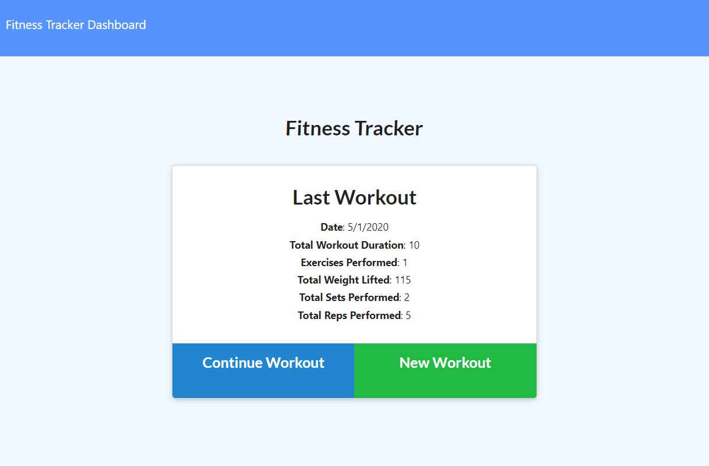
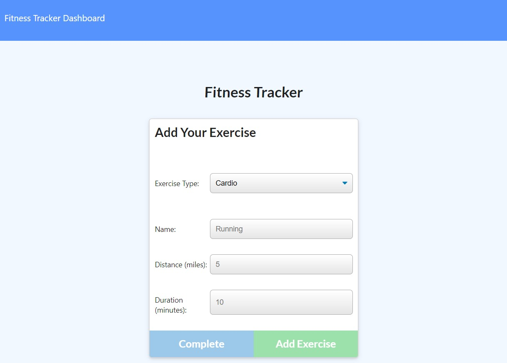
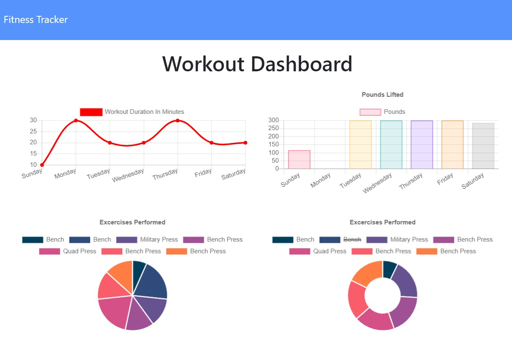

# Unit 17 Nosql Homework: Workout Tracker

This application is a fitness tracker created using JavaScript, NodeJS, Express, & MongoDB.

## User Story

As a user, I want to be able to view create and track daily workouts. I want to be able to log multiple exercises in a workout on a given day. I should also be able to track the name, type, weight, sets, reps, and duration of exercise. If the exercise is a cardio exercise, I should be able to track my distance traveled.

## Business Context

A consumer will reach their fitness goals quicker when they track their workout progress.

## Acceptance Criteria

When the user loads the page, they are given the option to create a new workout, or continue with their last workout.

The user is able to:

  * Add new exercises to a new workout plan, or continue a previous workout by adding new exercises to it.

  

  * View the combined information from the last 7 workouts on the stats dashboard.

  

## Links

The deployed application: [https://gt-fitness-tracker.herokuapp.com/](https://gt-fitness-tracker.herokuapp.com/)

The Github repository: [https://github.com/SamSherrill/17th-homework](https://github.com/SamSherrill/17th-homework)